
<h1 align="center">校园疫情防控信息管理系统的设计与实现</h1>

## 简介
校园疫情防控信息管理系统：角色分为管理员、用户；功能包括个人中心、用户管理、疫情信息管理、隔离信息管理、疫苗接种管理、交流论坛、防疫宣传、疫情数据统计和查询，旨在提高校园防控效率和信息管理能力。    --计算机毕业设计源码；毕设源码；java毕业设计源码

## 联系方式

<h3 align="center">获取完整代码与数据库文件 + 微信：deepguan QQ: 86050149 QQ群: 783742310</h3>

<h3 align="center">可帮忙远程部署 包运行成功！提供远程部署、修改代码、设计文档指导、代码讲解等服务！</h3>

## 功能介绍（完整见运行截图）
管理员： 基本功能包括登录、注册和退出。系统提供疫情信息管理、用户管理、疫苗接种管理、隔离信息管理等功能模块，通过这些模块管理员可以录入和查询疫情数据，管理用户信息，并生成疫情报告。管理员还可以管理系统的轮播图、通知公告、防疫宣传等内容，实现对系统信息的全面维护和更新，确保校园疫情防控措施的有效实施。

教师： 可登录系统查看和更新个人信息，访问疫情信息管理模块获取学校疫情相关的实时动态。教师在系统中具有发布及管理交流论坛帖子的权限，方便其与学生及其他教职工进行沟通和信息分享，还可以通过提交隔离信息和健康状况确保自身和班级学生的安全，并参与学校的疫苗接种管理。

学生： 登录后可以查看和编辑个人资料，访问疫苗接种模块查询接种信息，使用交流论坛与其他学生和教师进行互动。学生可以通过系统上报健康状况和隔离情况，及早获悉学校发布的疫情防控通知公告和防疫宣传内容，配合校园的疫情防控措施，确保个人及校园安全。

访客： 系统允许访客查看部分防疫宣传内容和通知公告，以便及时了解校园的疫情防控政策和动态。访客可以注册系统以获得更多权限，从而访问更多关于防疫信息的模块，如疫苗接种信息和疫情统计数据，确保及时掌握校园防控情况。

## 运行截图
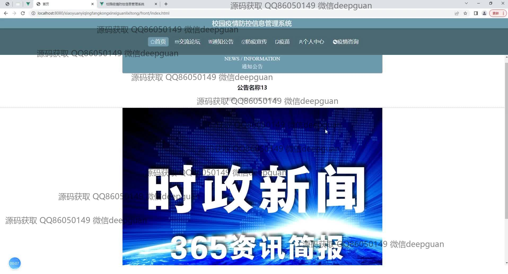
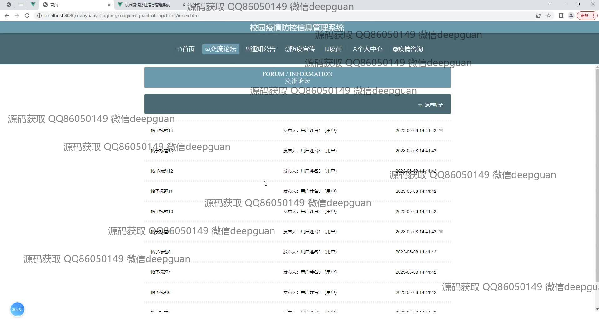
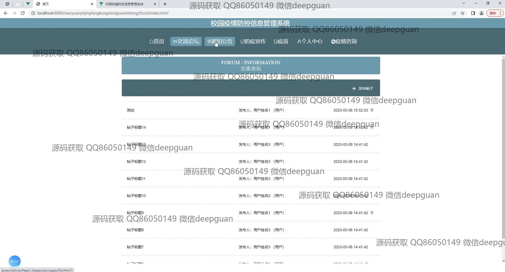
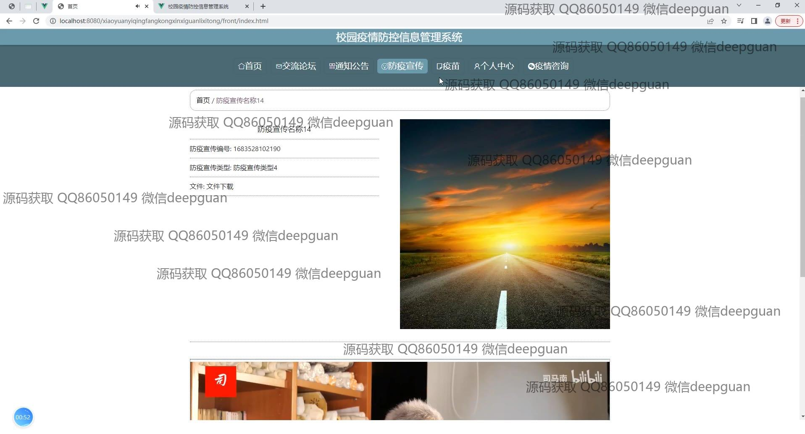
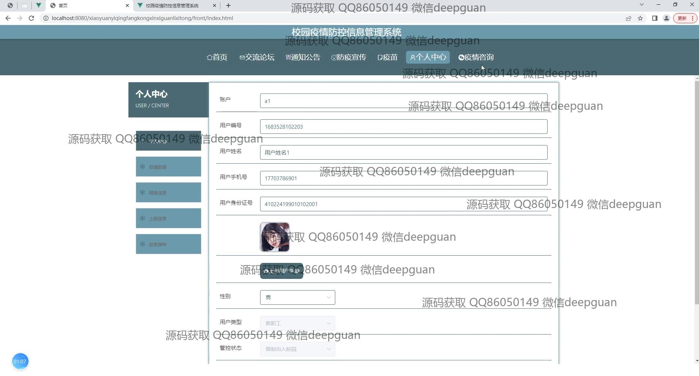
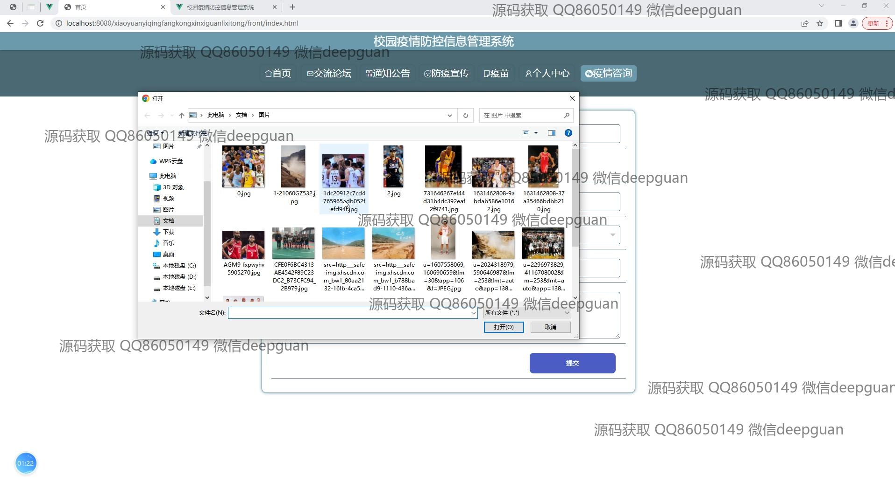
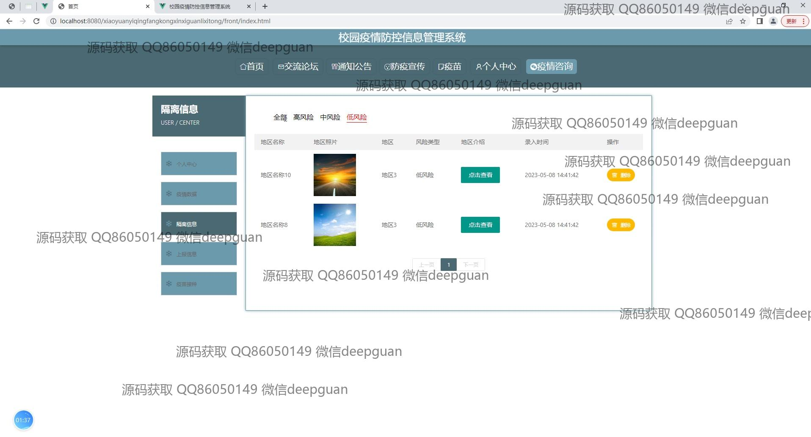
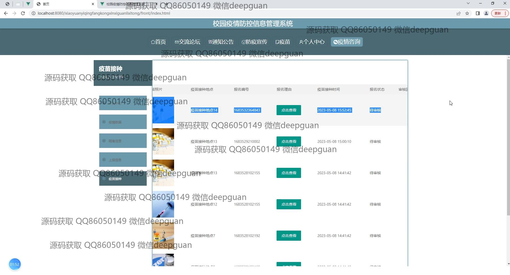
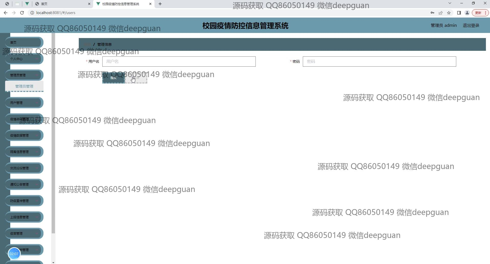
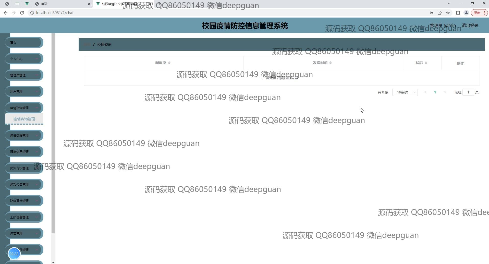
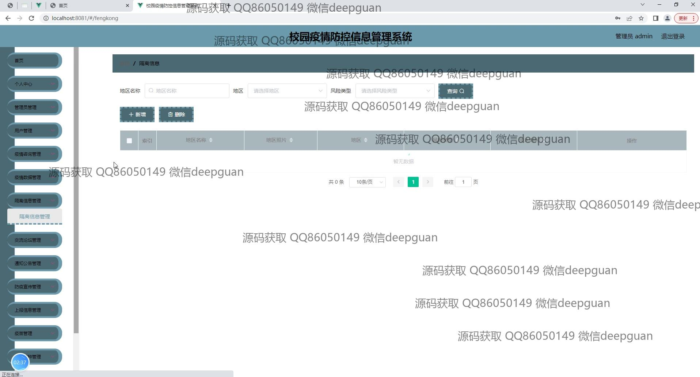
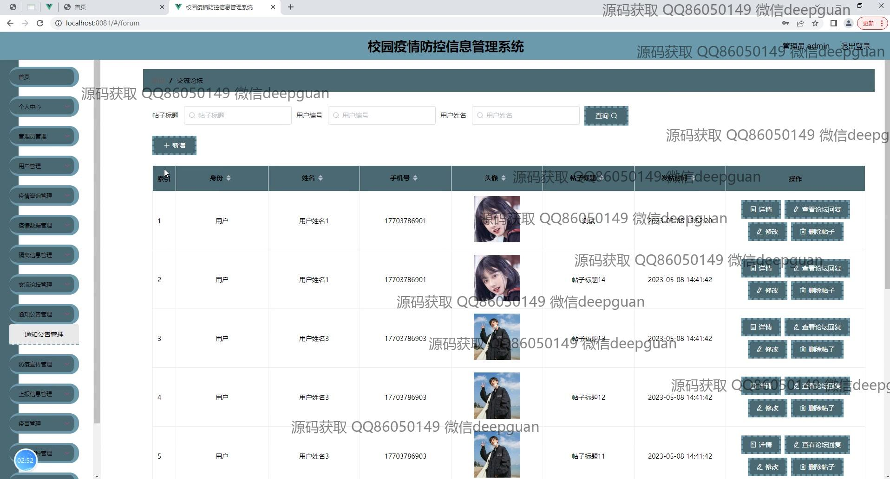
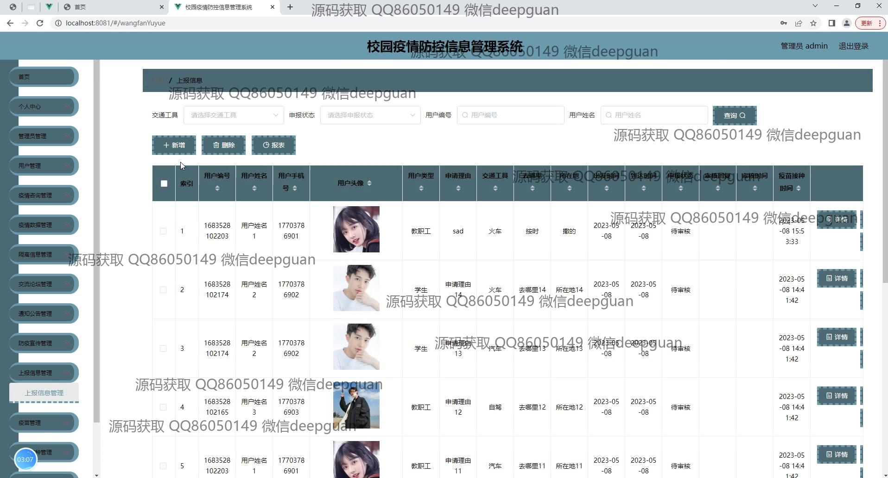
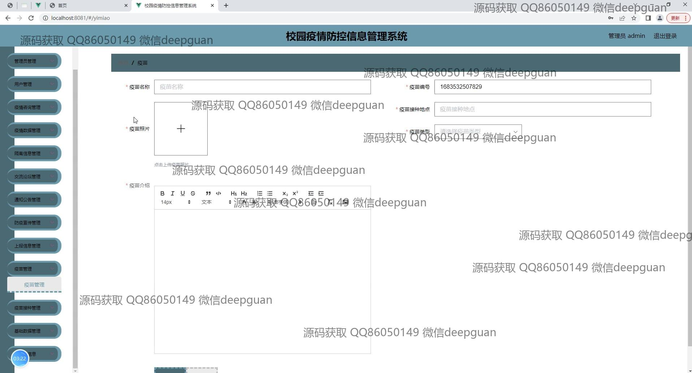
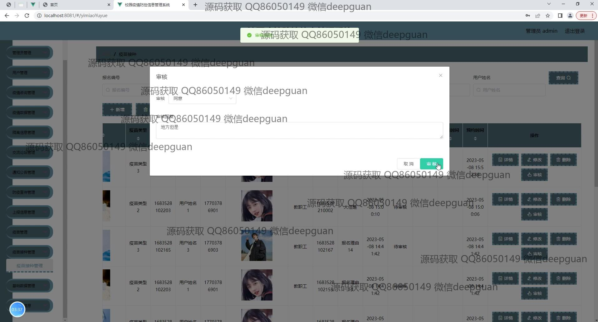
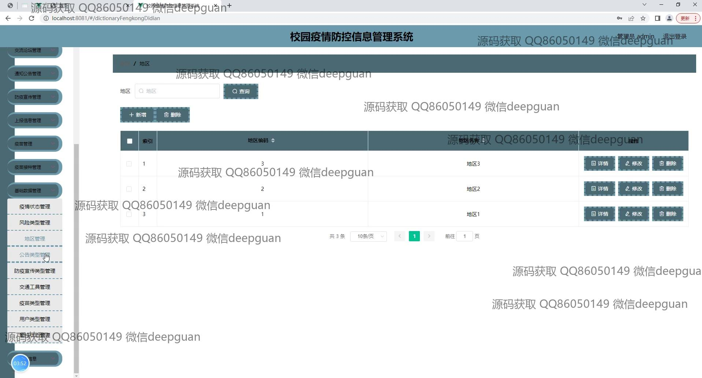
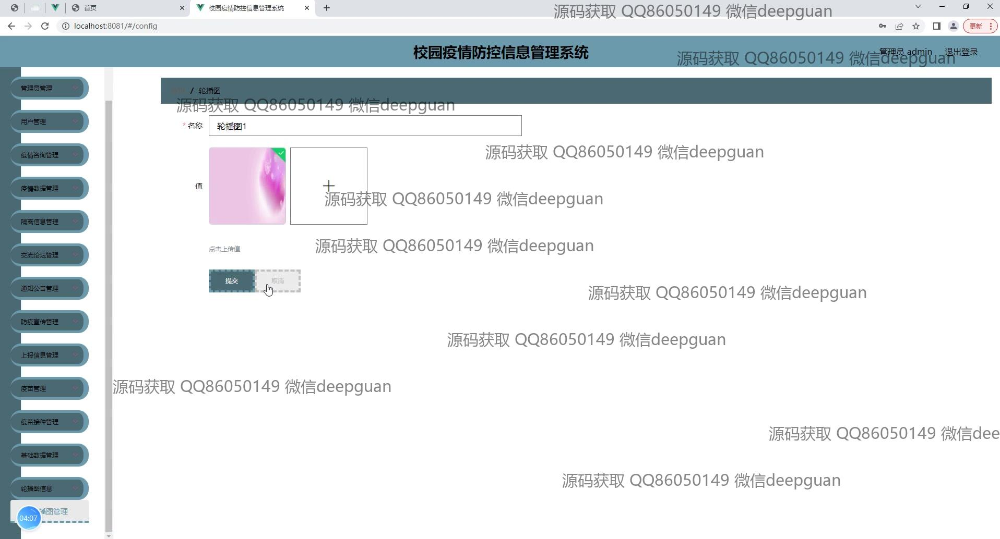

本代码来源于网络,仅供学习参考使用!

